

<a href="https://julian-hinestroza.vercel.app"></a>

 

 



Soy **Julian Hinestroza Duarte**, ingeniero de software y desarrollador full-stack en **Pereira, Colombia**. Construyo productos de punta a punta: el modelo de datos, la API, la interfaz que usa el cliente final y el despliegue para que todo quede funcionando en producción.

- **Producto real, usuarios reales.** Mis dos proyectos más grandes están en producción: una plataforma de torneos de pádel y un sistema de nóminas para un taller de confección.
- **Backend con criterio.** APIs REST con NestJS y Express, autenticación JWT, roles, validación, tareas programadas y rate limiting.
- **Frontend pensado para usarse.** Interfaces en React y Next.js que funcionan en el celular, porque mis usuarios trabajan desde la cancha o desde el taller.
- **Más allá de la web.** Escenas 3D procedurales con Three.js y shaders GLSL, y apps nativas Android con Kotlin y Jetpack Compose.

 


<a href="https://woaptournament.com"></a>

### WOAP Tournament · [woaptournament.com](https://woaptournament.com)

Plataforma integral para organizar torneos de pádel de principio a fin: **borrador → inscripción → sorteo → en curso → finalizado**. El objetivo es que un organizador lleve un torneo completo sin tocar una hoja de cálculo.

- Sorteo automático de grupos round-robin y cuadros eliminatorios en los que el ganador avanza solo.
- Ranking acumulado por categoría entre torneos, perfiles públicos de jugador y una landing abierta sin necesidad de iniciar sesión.
- Panel con tres roles (superadmin, admin y solo lectura), diseñado para usarse desde el celular entre partidos.
- API en **NestJS + Prisma** sobre **PostgreSQL (Supabase)** con JWT, rate limiting y tareas programadas que actualizan el estado de los torneos según sus fechas. El frontend usa **Next.js 14 + shadcn/ui**.

 

<a href="https://confeccionesnap.co"></a>

### Confecciones NAP · [confeccionesnap.co](https://confeccionesnap.co)

Sistema de nóminas por quincenas para un taller de confección.

- Registro de lotes, operaciones y paquetes de operaciones por trabajador.
- Cierre y apertura de quincenas, abonos con historial y cálculo automático del total a pagar.
- Exportación de desprendibles y reportes en PDF.
- Dos roles (administrador y trabajador), con la API REST en **Express 5 + MySQL** y el frontend en **React 19 + Vite + Material UI**.

 

  <a href="https://julian-hinestroza.vercel.app"></a>
  

<table>
  <tr>
    <td width="50%" valign="top">
      <b>Portafolio 3D</b> · <a href="https://julian-hinestroza.vercel.app">julian-hinestroza.vercel.app</a> 
      Un sistema solar procedural inspirado en <i>Outer Wilds</i> donde cada planeta es un proyecto. La geometría, los shaders y el sonido se generan por código.
    </td>
    <td width="50%" valign="top">
      <b>Gestor de gastos</b> · privado 
      App nativa Android para controlar los ingresos y gastos del hogar en pesos colombianos: gastos fijos y variables, recordatorios y balance por quincena. Es mi laboratorio para Kotlin y Jetpack Compose.
    </td>
  </tr>
</table>

 


 



 


 


<!-- LinkedIn (pendiente):

-->

 

<b>EN · Read in English</b>

 

I'm **Julian Hinestroza Duarte**, a software engineer and full-stack developer based in **Pereira, Colombia**. I build products end to end: the data model, the API, the interface the end user touches and the deployment that keeps it all running in production.

- **Real product, real users.** My two biggest projects are live: a padel tournament platform and a payroll system for a garment workshop.
- **Backend with judgment.** REST APIs with NestJS and Express, JWT auth, roles, validation, scheduled jobs and rate limiting.
- **Frontend built to be used.** React and Next.js interfaces that work on a phone, because my users work from the court or from the workshop floor.
- **Beyond the web.** Procedural 3D scenes with Three.js and GLSL shaders, and native Android apps with Kotlin and Jetpack Compose.

 

### WOAP Tournament · [woaptournament.com](https://woaptournament.com)

An all-in-one platform to run padel tournaments from start to finish: **draft → registration → draw → in progress → finished**. The goal is for an organizer to run a full tournament without touching a spreadsheet.

- Automatic round-robin group draws and knockout brackets where winners advance on their own.
- Cumulative ranking per category across tournaments, public player profiles and an open landing page with no login required.
- Admin panel with three roles (superadmin, admin and read-only), designed to be used on a phone between matches.
- **NestJS + Prisma** API on **PostgreSQL (Supabase)** with JWT, rate limiting and scheduled jobs that update tournament status based on their dates. The frontend runs on **Next.js 14 + shadcn/ui**.

 

### Confecciones NAP · [confeccionesnap.co](https://confeccionesnap.co)

A fortnightly payroll system for a garment workshop.

- Tracking of batches, operations and operation bundles per worker.
- Closing and opening pay periods, advances with full history and automatic calculation of the amount due.
- Payslip and report export to PDF.
- Two roles (administrator and worker), with a REST API on **Express 5 + MySQL** and a frontend on **React 19 + Vite + Material UI**.

 

  
  

<table>
  <tr>
    <td width="50%" valign="top">
      <b>3D Portfolio</b> · <a href="https://julian-hinestroza.vercel.app">julian-hinestroza.vercel.app</a> 
      A procedural solar system inspired by <i>Outer Wilds</i> where every planet is a project. Geometry, shaders and sound are all generated in code.
    </td>
    <td width="50%" valign="top">
      <b>Expense manager</b> · private 
      Native Android app to track household income and expenses in Colombian pesos: fixed and variable expenses, reminders and per-fortnight balance. My lab for Kotlin and Jetpack Compose.
    </td>
  </tr>
</table>

 

 

 

 

 

